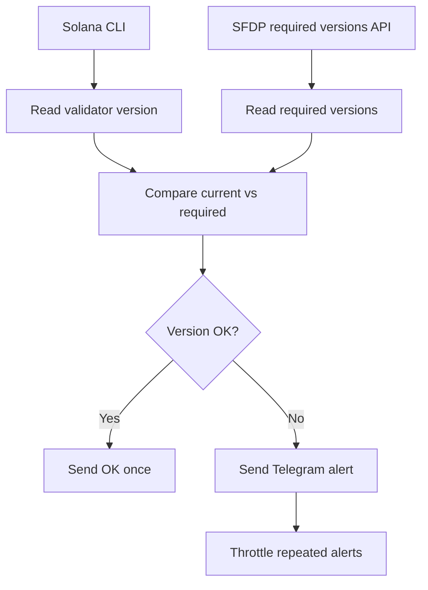

# 🚀 Solana Release Alerts

**Telegram alerts for Solana validator release requirements.**

A lightweight operator bot that checks your validator version against Solana Foundation Delegation Program release requirements and notifies you before an epoch deadline becomes a problem.


---

## ✨ What it does

- 🛰️ Checks Solana validator software versions on **mainnet-beta** and optional **testnet**.
- 📡 Reads required Agave/Firedancer versions from the Solana Foundation Delegation Program API.
- 🔔 Sends Telegram alerts when a validator version needs attention.
- ⏱️ Shows current epoch and estimated time left in the epoch.
- 🧯 Suppresses noisy transient RPC failures with retry thresholds.
- 📊 Supports manual `/status` checks and an inline Telegram status button.
- 🔐 Does **not** require private keys.

## 🧭 Why this is useful

Validator operators need to react quickly to required client upgrades. This bot reduces the chance of missing release deadlines by turning version requirements into direct Telegram notifications.

It is designed as a small, auditable contribution for validator operations tooling: simple to run, easy to inspect, and safe to deploy next to an existing validator setup.

## 📨 Example alert

```text
⚠️ [mainnet] Version not updated!

Validator: <vote account pubkey>
Current version: 1.18.x
Required by epoch 742: 2.0.x

Current epoch: 741
Time left in epoch: 7h 25m
```

## 🧩 How it works



## ✅ Requirements

- Python **3.10+**
- Solana CLI installed and available as `solana`
- Telegram bot token
- Telegram chat ID
- Validator vote account pubkey

## ⚙️ Installation

```bash
git clone https://github.com/web3validator/solana-release-alerts.git
cd solana-release-alerts
python3 -m venv venv
./venv/bin/pip install -r requirements.txt
cp .env.example .env
```

Edit `.env`:

```env
TELEGRAM_TOKEN=your_telegram_bot_token
TELEGRAM_CHAT_ID=your_telegram_chat_id
MAINNET_VOTE_PUBKEY=your_mainnet_vote_account_pubkey
TESTNET_VOTE_PUBKEY=
SOLANA_BIN=solana
CHECK_INTERVAL_SECONDS=1800
RPC_ERROR_ALERT_ATTEMPTS=3
```

`TESTNET_VOTE_PUBKEY` is optional. Leave it empty if you only want mainnet checks.

## ▶️ Run

```bash
./venv/bin/python bot.py
```

On first start, the bot validates required configuration and then begins periodic checks.

## 💬 Telegram commands

| Command | Description |
| --- | --- |
| `/start` | Run a status check |
| `/status` | Run a manual status check |

Alerts also include an inline **📊 Status** button.

## 🛠️ Systemd

An example service file is included: [`version-check-bot.service`](version-check-bot.service).

Adjust `User`, `WorkingDirectory`, and `ExecStart` for your server, then install it:

```bash
sudo cp version-check-bot.service /etc/systemd/system/solana-release-alerts.service
sudo systemctl daemon-reload
sudo systemctl enable --now solana-release-alerts
sudo journalctl -u solana-release-alerts -f
```

## 🔐 Security notes

This repository should never contain secrets or validator key material.

Ignored by default:

- `.env` and local environment files
- runtime `state.json`
- virtual environments
- backups
- logs
- validator identity and vote-account keypair files

The bot only needs a vote account public key and does not need access to private validator keys.

## 📁 Project structure

```text
.
├── bot.py                       # Main loop, setup wizard, Telegram polling
├── checker.py                   # Solana CLI + required version checks
├── config.py                    # Environment-based configuration
├── notifier.py                  # Telegram message formatting and delivery
├── state.py                     # Local alert throttling state
├── requirements.txt
├── version-check-bot.service    # Example systemd service
└── .env.example
```

## 🤝 Contributions

Ideas and pull requests are welcome, especially around:

- more client/version metadata
- richer Telegram status output
- additional notification channels
- tests and CI
- validator operator UX improvements

## 📄 License

MIT
